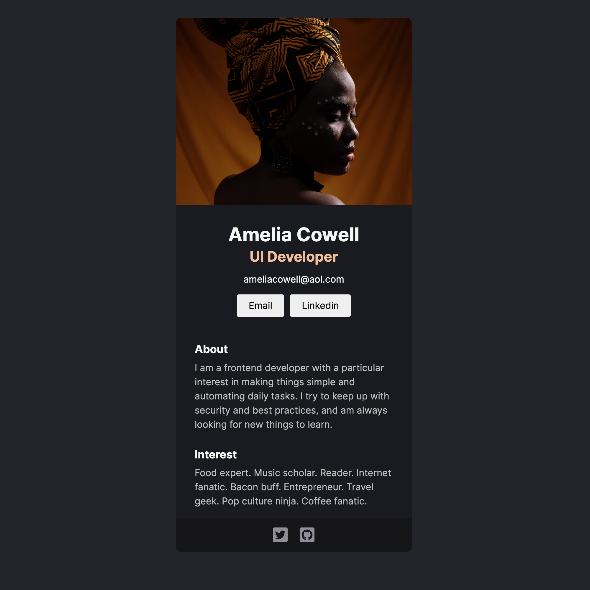

# co2154311a3829e59196db970

Quick start:

```
$ yarn # npm install
$ yarn build # npm run build
````

## Development

Run Webpack in watch-mode to continually compile the JavaScript as you work:

```
$ yarn watch # npm run watch
```

## Profile Card

The Profile Card project is to build a single page using React and render information. The project is to work on creating components in React.


Solo project from [The Frontend Career Path](https://scrimba.com/learn/frontend) at Scrimba